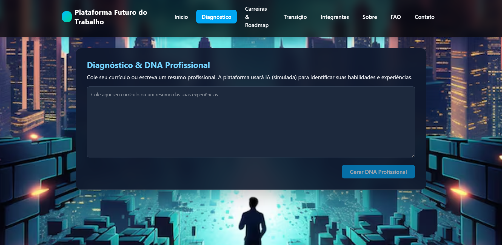
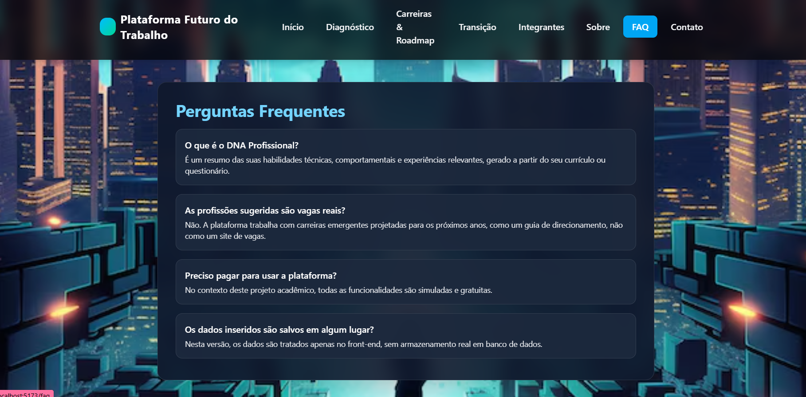

# 🌐 Plataforma Futuro do Trabalho - Front-End

Projeto desenvolvido para a disciplina **Front-End Design Engineering** (FIAP) – 2º semestre.  
Este repositório contém a implementação do front-end da plataforma **Futuro do Trabalho**, uma solução digital que utiliza **Inteligência Artificial** para apoiar profissionais na adaptação às **carreiras emergentes**.

A aplicação inclui telas de **login, cadastro, home, diagnóstico (DNA profissional), mapeamento de carreiras, roadmap, gestão de transição, integrantes, sobre, FAQ e contato**, com foco em usabilidade, visual moderno e navegação clara entre os módulos.

---

## 🚀 Tecnologias Utilizadas
- [React](https://react.dev/) com TypeScript  
- [Vite](https://vitejs.dev/) para build e execução  
- [Tailwind CSS](https://tailwindcss.com/) para estilização  
- [React Router DOM](https://reactrouter.com/) para navegação entre páginas  
- [React Hook Form](https://react-hook-form.com/) para formulários e validação  

---

## 👩‍💻 Integrantes
- **Julia Queiroz de Oliveira** – RM 561583 – 1TDSPI  
- **Leticia Santiago e Silva** – RM 565799 – 1TDSPI  
- **Juliana da Silva Stigliani** – RM 561171 – 1TDSPJ  

---

## 🧠 Funcionalidades Principais da Plataforma

- **Login e Cadastro**
  - Tela de login com validação de formulário e modal de “esqueci minha senha”.
  - Tela de cadastro com validação de senha e confirmação.

- **Home**
  - Página inicial com cards de navegação para:
    - Diagnóstico & DNA Profissional  
    - Carreiras & Roadmap  
    - Gestão da Transição  
    - Integrantes, Sobre, FAQ e Contato  

- **Diagnóstico & DNA Profissional**
  - Área para o usuário colar seu currículo ou resumo profissional.
  - Simulação de análise por IA, gerando:
    - Habilidades técnicas  
    - Habilidades comportamentais  
    - Experiências relevantes  

- **Carreiras & Roadmap**
  - Lista de **profissões emergentes** (ex.: Especialista em Ética de IA, Designer de Experiências para Metaverso, Analista de Carbono Digital).  
  - Índice de compatibilidade simulado para cada carreira.  
  - Geração de um roadmap simplificado com:
    - Habilidades dominadas  
    - Habilidades a desenvolver  
    - Cursos e certificações sugeridos  

- **Gestão da Transição Profissional**
  - Módulo de tarefas e metas baseado no roadmap.  
  - Criação, listagem e marcação de tarefas como concluídas.  
  - Barra de progresso mostrando % de conclusão da transição.

- **Páginas Institucionais**
  - **Sobre**: explicação da proposta do projeto, contexto acadêmico e objetivos da solução.  
  - **Integrantes**: lista da equipe com nome, RM, turma, GitHub e LinkedIn (com suporte a foto de cada integrante).  
  - **FAQ**: perguntas e respostas frequentes sobre o funcionamento da plataforma.  
  - **Contato**: formulário para envio de mensagem (nome, e-mail, mensagem) – simulado no front-end.

---


## 🛠️ Instalação

### 1. Clone o repositório
git clone https://github.com/ORGANIZACAO/REPOSITORIO.git
2. Acesse o diretório
bash
Copiar código
cd gs
3. Instale as dependências
bash
Copiar código
npm install
4. Execute o projeto
bash
Copiar código
npm run dev

---
Rotas Principais
Rota	Página	Descrição
/	Login	Tela de entrada
/cadastro	Cadastro	Criar conta
/home	Home	Navegação principal
/diagnostico	Diagnóstico	Análise de currículo
/carreiras	Carreiras	Profissões emergentes
/transicao	Transição	Gestão de tarefas e metas
/integrantes	Integrantes	Equipe e informações
/faq	FAQ	Perguntas frequentes
/contato	Contato	Formulário de contato
/chat	Chatbot	Assistente virtual

---

## 👩‍💻 Autores e Créditos

| Nome | RM | Turma | GitHub | LinkedIn |
|------|------|--------|---------|-----------|
| **Julia Queiroz de Oliveira** | 561583 | 1TDSPI | https://github.com/Ju-queiroz | https://www.linkedin.com/in/julia-queiroz-de-oliveira-180576379/ |
| **Leticia Santiago e Silva** | 565799 | 1TDSPI | https://github.com/santiago-leticia |https://www.linkedin.com/in/leticia-santiago-6b9219354?utm_source=share&utm_campaign=share_via&utm_content=profile&utm_medium=ios_app |
| **Juliana da Silva Stigliani** | 561171 | 1TDSPJ | https://github.com/justigliani | https://linkedin.com/in/ |


---

## 🔗 Links Importantes

- **Repositório GitHub:** _https://github.com/GlobalSolution2Front/gs2_  
- **Vídeo da Apresentação (YouTube):** _adicione aqui_  


---

## 🖼️ Imagens do Projeto


### Tela de Login  


### Tela de Diagnóstico & DNA Profissional  



### Tela de Gestão da Transição  


### Tela de Integrantes  


### Tela de FAQ  


### Tela de Contato  


---

## 📂 Estrutura de Pastas (resumo)

---

## 📌 Sumário
1. [Descrição do Projeto](#-descrição-do-projeto)  
2. [Status do Projeto](#-status-do-projeto)  
3. [Tecnologias Utilizadas](#-tecnologias-utilizadas)  
4. [Instalação](#-instalação)  
5. [Como Usar](#-como-usar)  
6. [Estrutura de Pastas](#-estrutura-de-pastas)  
7. [Rotas Principais](#-rotas-principais)  
8. [Funcionalidades](#-funcionalidades-da-plataforma)  
9. [Imagens do Projeto](#-imagens-do-projeto)  
10. [Autores e Créditos](#-autores-e-créditos)  
11. [Links Importantes](#-links-importantes)  
12. [Contato](#-contato)

---

```bash
src/
  assets/
    fundo.avif

  components/
    NavBar.tsx
  
  pages/
    login.tsx
    cadastro.tsx
    home.tsx
    diagnostico.tsx
    carreiras.tsx
    transicao.tsx
    integrantes.tsx
    sobre.tsx
    faq.tsx
    contato.tsx
  App.tsx
  main.tsx

  

  


 
